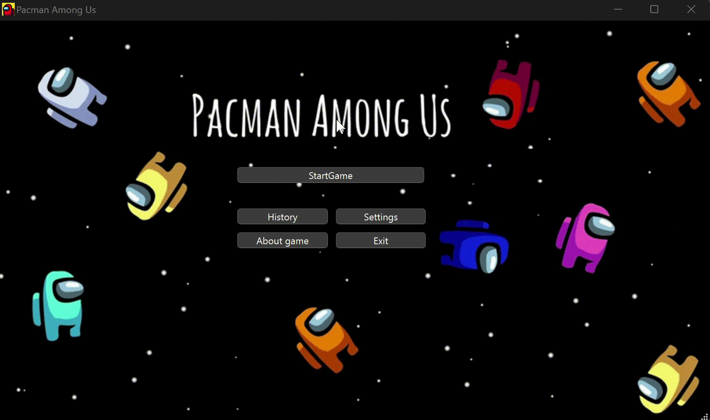

# Pacman-Among-Us
Игра была написана в качестве курсовой работы по дисциплине *"Методы и стандарты программирования"*. 

Работа написана с использованием фреймворка **QT creator**(c++), графической библиотеки **SFML** и редактора карт **Tiled Map Editor**.

# Игровой процесс
Игра представляет из себя смесь классической версии игры Pacman с элементами игры Among Us. 
Логика игрового процесса аналогична игре Pacman, но есть некоторые особенности:
- **Цель игрока - создать 4** саботажа в специальных локациях. По достижении цели начинается следующий уровень. На нем увеличивается скорость врагов и увеличивается время перезарядки между созданием саботажей. 
- На карте есть вентиляция, по которой главный игро способен перемещаться на другой конец карты.

Для перемещения по вентиляции или создания саботажа, необходимо встать рядом с ними и нажать клавишу "E"
### Общий вид игры

### Жизни
У игрока есть всего три жизни на игру: они не обновляются на новом уровне и игра завершается, если жизней не осталось

### Энерджайзеры
Как и в классическом Pacman'е, на карте есть 4 энерджайзера, съев которые, игрок на некоторое время приобретает способность убивать врагов.

### Саботажи

### Вентиляция

# *Menu*
При запуске игры пользователя встречает меню:

## *Settings*
Раздел **"Settings"** предоставляет доступ к:
- включению/выключению звуков в игре
- смене клавиш, отвечающих за передвижение (wasd либо стандартные стрелки)
- смене ника игрока, который будет отображаться во время следующей игры

## *History*
Раздел **"History"** содержит информацию о предыдущих сессиях пользователя. Информация загружается из csv-файла и обновляется автоматически после каждой игры.

## *About game*
В разделе **"About game"** пользователю предлагается перейти по ссылке на данный репозиторий, в этом readme файле он может найти всё, что его интересует.
